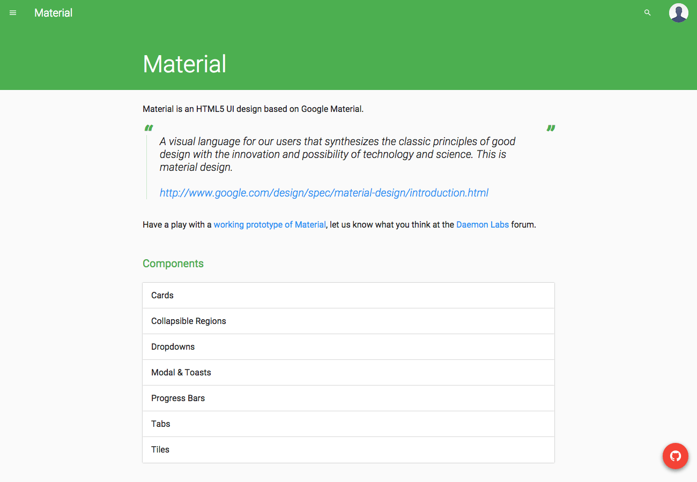

# Material

HTML5 UI design based on Google Material Design and built on top of Bootstrap.

> a visual language for our users that synthesizes the classic principles of good design with the innovation and possibility of technology and science. This is material design.
> http://www.google.com/design/spec/material-design/introduction.html

